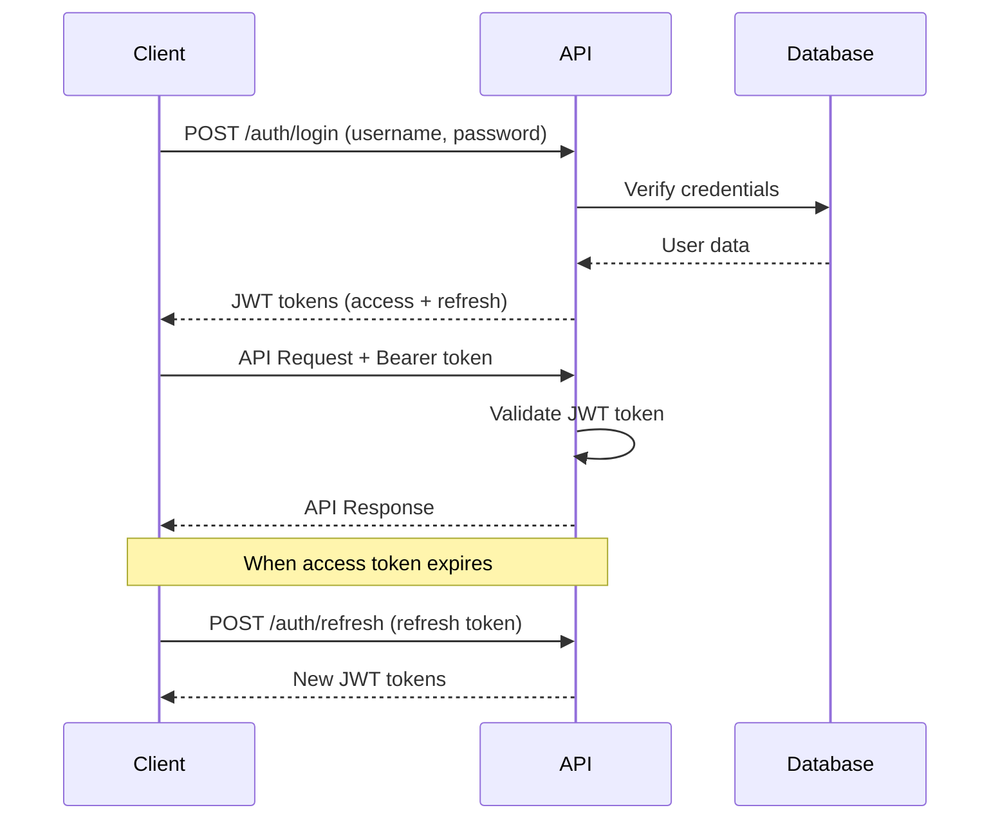

# Authentication Guide - Holiday API Indonesia

## Overview

Holiday API Indonesia menggunakan **JWT (JSON Web Token)** authentication system yang secure dan scalable. Sistem ini mendukung role-based access control dengan dua level akses: **Super Admin** dan **Admin**.

## Authentication Flow



## Default Credentials

```
Username: admin
Password: Admin123!
Role: super_admin
```

## Token Types

### Access Token
- **Purpose**: Authenticate API requests
- **Expiration**: 15 minutes (configurable)
- **Usage**: Include in Authorization header

### Refresh Token
- **Purpose**: Generate new access tokens
- **Expiration**: 7 days (configurable)
- **Usage**: Use when access token expires

## User Roles

### Super Admin (`super_admin`)
- Full system access
- Can create/delete users
- Can manage holidays
- Can view all audit logs
- Can access all admin endpoints

### Admin (`admin`)
- Can manage holidays
- Can view own audit logs
- Limited admin access

## Step-by-Step Authentication

### 1. Login and Get Tokens

```bash
curl -X POST "http://localhost:8080/api/v1/auth/login" \
  -H "Content-Type: application/json" \
  -d '{
    "username": "admin",
    "password": "Admin123!"
  }'
```

**Response:**
```json
{
  "success": true,
  "message": "Login successful",
  "data": {
    "user": {
      "id": 1,
      "username": "admin",
      "email": "admin@holidayapi.com",
      "role": "super_admin",
      "is_active": true,
      "created_at": "2024-01-01T00:00:00Z",
      "last_login": "2024-01-01T12:00:00Z"
    },
    "access_token": "eyJhbGciOiJIUzI1NiIsInR5cCI6IkpXVCJ9...",
    "refresh_token": "eyJhbGciOiJIUzI1NiIsInR5cCI6IkpXVCJ9...",
    "expires_in": 900,
    "token_type": "Bearer"
  }
}
```

### 2. Use Access Token for API Calls

```bash
# Save the access token
ACCESS_TOKEN="eyJhbGciOiJIUzI1NiIsInR5cCI6IkpXVCJ9..."

# Make authenticated request
curl -X GET "http://localhost:8080/api/v1/auth/profile" \
  -H "Authorization: Bearer $ACCESS_TOKEN"
```

### 3. Refresh Token When Expired

```bash
curl -X POST "http://localhost:8080/api/v1/auth/refresh" \
  -H "Content-Type: application/json" \
  -d '{
    "refresh_token": "your-refresh-token-here"
  }'
```

## Password Requirements

Passwords must meet the following criteria:
- Minimum 8 characters
- At least 1 uppercase letter (A-Z)
- At least 1 lowercase letter (a-z)
- At least 1 digit (0-9)
- At least 1 special character (!@#$%^&*()_+-=[]{}|;:,.<>?)

## Error Handling

### Common Authentication Errors

#### Invalid Credentials (401)
```json
{
  "success": false,
  "message": "Authentication failed",
  "error": "invalid credentials"
}
```

#### Token Expired (401)
```json
{
  "success": false,
  "message": "Unauthorized",
  "error": "Invalid or expired token"
}
```

#### Insufficient Permissions (403)
```json
{
  "success": false,
  "message": "Forbidden",
  "error": "Insufficient permissions"
}
```

## Security Best Practices

### For Developers

1. **Store tokens securely**
   - Use secure storage (not localStorage for sensitive apps)
   - Implement proper token cleanup on logout

2. **Handle token expiration**
   - Implement automatic token refresh
   - Graceful handling of expired tokens

3. **Use HTTPS in production**
   - Never send tokens over HTTP
   - Enable security headers

### For Administrators

1. **Change default credentials**
   - Update admin password immediately
   - Use strong, unique passwords

2. **Regular security audits**
   - Monitor audit logs regularly
   - Review user access periodically

3. **Environment security**
   - Use strong JWT secret keys
   - Rotate secrets regularly
   - Use environment-specific configurations

## Code Examples

### JavaScript/Node.js
```javascript
class HolidayAPIClient {
  constructor(baseURL) {
    this.baseURL = baseURL;
    this.accessToken = null;
    this.refreshToken = null;
  }

  async login(username, password) {
    const response = await fetch(`${this.baseURL}/auth/login`, {
      method: 'POST',
      headers: { 'Content-Type': 'application/json' },
      body: JSON.stringify({ username, password })
    });
    
    const data = await response.json();
    if (data.success) {
      this.accessToken = data.data.access_token;
      this.refreshToken = data.data.refresh_token;
    }
    return data;
  }

  async makeAuthenticatedRequest(endpoint, options = {}) {
    const response = await fetch(`${this.baseURL}${endpoint}`, {
      ...options,
      headers: {
        ...options.headers,
        'Authorization': `Bearer ${this.accessToken}`
      }
    });

    if (response.status === 401) {
      // Token expired, try to refresh
      await this.refreshAccessToken();
      // Retry the request
      return this.makeAuthenticatedRequest(endpoint, options);
    }

    return response.json();
  }

  async refreshAccessToken() {
    const response = await fetch(`${this.baseURL}/auth/refresh`, {
      method: 'POST',
      headers: { 'Content-Type': 'application/json' },
      body: JSON.stringify({ refresh_token: this.refreshToken })
    });
    
    const data = await response.json();
    if (data.success) {
      this.accessToken = data.data.access_token;
      this.refreshToken = data.data.refresh_token;
    }
  }
}
```

### Python
```python
import requests
import json
from datetime import datetime, timedelta

class HolidayAPIClient:
    def __init__(self, base_url):
        self.base_url = base_url
        self.access_token = None
        self.refresh_token = None
        self.token_expires_at = None

    def login(self, username, password):
        response = requests.post(
            f"{self.base_url}/auth/login",
            json={"username": username, "password": password}
        )
        
        data = response.json()
        if data.get("success"):
            self.access_token = data["data"]["access_token"]
            self.refresh_token = data["data"]["refresh_token"]
            expires_in = data["data"]["expires_in"]
            self.token_expires_at = datetime.now() + timedelta(seconds=expires_in)
        
        return data

    def _ensure_valid_token(self):
        if not self.access_token:
            raise Exception("Not authenticated")
        
        if datetime.now() >= self.token_expires_at:
            self.refresh_access_token()

    def make_authenticated_request(self, endpoint, method="GET", **kwargs):
        self._ensure_valid_token()
        
        headers = kwargs.get("headers", {})
        headers["Authorization"] = f"Bearer {self.access_token}"
        kwargs["headers"] = headers
        
        response = requests.request(method, f"{self.base_url}{endpoint}", **kwargs)
        return response.json()

    def refresh_access_token(self):
        response = requests.post(
            f"{self.base_url}/auth/refresh",
            json={"refresh_token": self.refresh_token}
        )
        
        data = response.json()
        if data.get("success"):
            self.access_token = data["data"]["access_token"]
            self.refresh_token = data["data"]["refresh_token"]
            expires_in = data["data"]["expires_in"]
            self.token_expires_at = datetime.now() + timedelta(seconds=expires_in)
```

## Troubleshooting

### Token Issues
- **Problem**: "Invalid or expired token"
- **Solution**: Use refresh token to get new access token

### Permission Issues
- **Problem**: "Insufficient permissions"
- **Solution**: Check user role and endpoint requirements

### Login Issues
- **Problem**: "Invalid credentials"
- **Solution**: Verify username/password, check account status

For more help, check the audit logs or contact system administrator.
